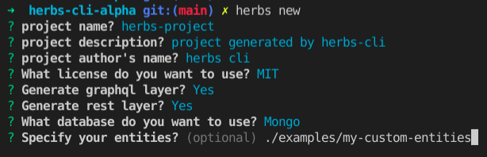
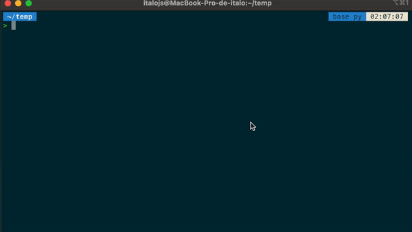

# herbs CLI

CLI helps speed up your development cycle with HerbsJS by generating use cases and infrastructure layers (REST, GraphQL, Repositories, etc) based on your entities.

## Installing and generating a CRUD project

To install herbs-cli:

```bash
npm i -g @herbsjs/herbs-cli 
```

Then run:

```bash
herbs new 
```





## Default generated project structure

```bash
.
├── node_modules
├── package-lock.json
├── package.json
└── src
    ├── config
    │   ├── api.js
    │   ├── index.js
    │   └── mongo.js
    ├── domain
    │   ├── entities
    │   │   ├── index.js
    │   │   └── user.js
    │   ├── errors
    │   │   ├── index.js
    │   │   ├── notFound.js
    │   │   └── notValid.js
    │   └── usecases
    │       ├── index.js
    │       └── user
    │           ├── createUser.js
    │           ├── deleteUser.js
    │           ├── getByIdUser.js
    │           └── updateUser.js
    ├── index.js
    └── infra
        ├── api
        │   ├── graphql
        │   │   ├── defaultResolver.js
        │   │   ├── index.js
        │   │   ├── inputs.js
        │   │   ├── mutations.js
        │   │   ├── queries.js
        │   │   └── types.js
        │   ├── rest
        │   │   └── index.js
        │   └── server.js
        └── data
            ├── database
            │   └── index.js
            └── repositories
                ├── baseRepository.js
                ├── index.js
                └── userRepository.js
```

## commands

### herbs new

Generate a new project based on your entities(or not)

> herbs new

#### Options

| Question | Description | Default value | e.g |
|--|--|--|--|
| Project name? | This is the Project Name that will be used int the project folder name and package.json. | herbs-project | my-project
| Project description? | This is the Project description that will be used int the package.json | project generated by herbs-cli | my beautiful project
| Project author's name? | This is the author's name that will be used int the package.json. | herbs CLI | Charlie
What license do you want to use? | Use arrow keys to choose your License. | -- | -- |
Generate graphql layer? | This will generate a graphql layer for your domain. | Y | n |
Generate rest layer? | Description | Y | n |
What database do you want to use? | Use arrow keys to choose your Database. | -- | -- |
Specify your entities folder path? (optional) | If you have [Gotu](https://github.com/herbsjs/gotu) entities, specify the folder path for CLI generate the project around that | empty | ./example/my-custom-entities/ |

### herbs update

Generate all necessary layers(graphql, rest, repository, etc) based on your new entity added into entities folder

After had created a new entity into entities folder, type in your terminal:
> herbs update

### Contribute

Come with us to make an awesome *herbs-cli*.

Now, if you do not have the technical knowledge and also have intended to help us, do not feel shy, [click here](https://github.com/herbsjs/herbs-cli/issues) to open an issue and collaborate their ideas, the contribution may be a criticism or a compliment (why not?)

If you would like to help contribute to this repository, please see [CONTRIBUTING](https://github.com/herbsjs/herbs-cli/blob/master/.github/CONTRIBUTING.md)
