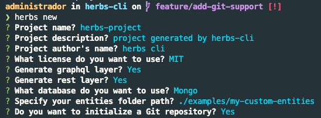

[](https://github.com/herbsjs/herbs-cli/actions/workflows/cd.yml) [](https://codecov.io/gh/herbsjs/herbs-cli)


# herbs CLI

CLI helps speed up your development cycle with HerbsJS by generating use cases and infrastructure layers (REST, GraphQL, Repositories, etc) based on your entities.

## Installing and generating a CRUD project

To install herbs-cli:

```bash
npm i -g @herbsjs/herbs-cli
```

Then run:

```bash
herbs new
```




## Default generated project structure

```bash
.
├── package-lock.json
├── package.json
└── src
    ├── domain
    │   ├── entities
    │   └── usecases
    └── infra
        ├── api
        │   ├── graphql
        │   ├── rest
        ├── config
        └── data
            ├── database
            │   └── migrations
            └── repositories
```

## commands

### herbs new

Generate a new project based on your entities(or not)

> herbs new


#### Options

| Question                                      | Description                                                                                                                    | Default value                  | e.g                           |
| --------------------------------------------- | ------------------------------------------------------------------------------------------------------------------------------ | ------------------------------ | ----------------------------- |
| Project name?                                 | This is the Project Name that will be used int the project folder name and package.json.                                       | herbs-project                  | my-project                    |
| Project description?                          | This is the Project description that will be used int the package.json                                                         | project generated by herbs-cli | my beautiful project          |
| Project author's name?                        | This is the author's name that will be used int the package.json.                                                              | herbs CLI                      | Charlie                       |
| What license do you want to use?              | Use arrow keys to choose your License.                                                                                         | --                             | --                            |
| Generate graphql layer?                       | This will generate a graphql layer for your domain.                                                                            | Y                              | n                             |
| Generate rest layer?                          | This will generate a rest layer for your domain.                                                                                                                    | Y                              | n                             |
| What database do you want to use?             | Use arrow keys to choose your Database.                                                                                        | --                             | --                            |
| Do you want to initialize a Git repository?             | This will initialize a git repository for your project.                                                                                                                    | N                              | y                             |
| Do you want to install dependencies?             | This will run npm install and npm start for you                                                                                                                   | no                              | yes                             |

You also can run the project passing the options though CLI 

> herbs new --name MyAwesomeProjectName --description "my description"  --author "name of the author" --license MIT --graphql --rest --database postgres --npmInstall yes


### herbs update

Generate all necessary layers(graphql, rest, repository, etc) based on your new entity added into entities folder

After had created a new entity into entities folder, type in your terminal:

> herbs update

### Contribute

Come with us to make an awesome _herbs-cli_.

Now, if you do not have the technical knowledge and also have intended to help us, do not feel shy, [click here](https://github.com/herbsjs/herbs-cli/issues) to open an issue and collaborate their ideas, the contribution may be a criticism or a compliment (why not?)

If you would like to help contribute to this repository, please see [CONTRIBUTING](https://github.com/herbsjs/herbs-cli/blob/master/.github/CONTRIBUTING.md)
